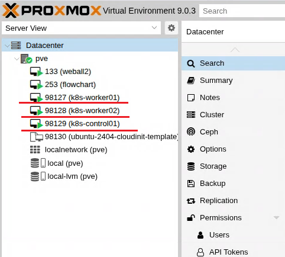
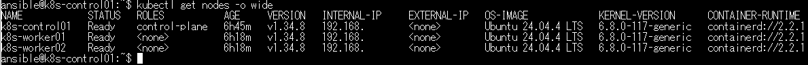
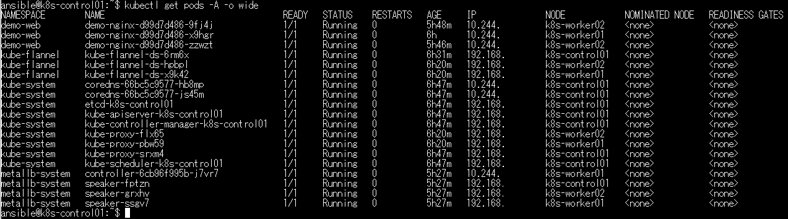
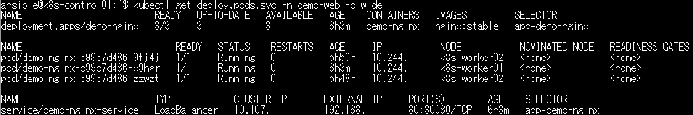
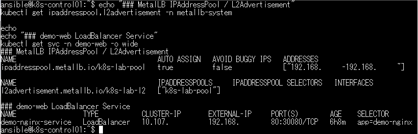
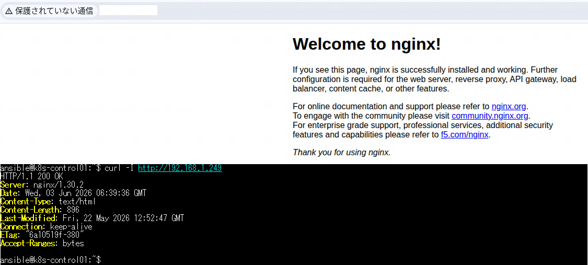
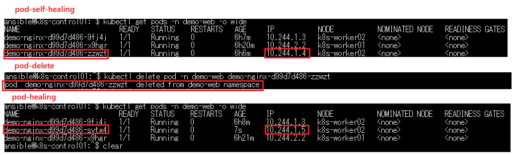

# Kubernetes Lab Ansible on Proxmox VE

Ansible portfolio project for building a Kubernetes lab cluster on Proxmox VE using kubeadm, containerd, Flannel CNI, MetalLB, and a demo nginx Deployment.

## Overview

This project automates the creation of Kubernetes lab VMs on Proxmox VE and configures a three-node Kubernetes cluster.

The lab demonstrates:

- Proxmox API based VM provisioning
- Ubuntu cloud-init template cloning
- Kubernetes cluster setup with kubeadm
- containerd runtime configuration
- Flannel CNI installation
- Worker node join automation
- Demo nginx Deployment with 3 replicas
- Kubernetes self-healing behavior
- MetalLB LoadBalancer support for an on-premise lab environment

## Architecture

```text
Client PC
   |
   | HTTP
   |
MetalLB LoadBalancer IP
   |
Kubernetes Service
   |
demo-nginx Deployment
   |
+-------------------+-------------------+-------------------+
| k8s-control01      | k8s-worker01       | k8s-worker02       |
| 192.168.56.129     | 192.168.56.127     | 192.168.56.128     |
+-------------------+-------------------+-------------------+
        |
        |
Proxmox VE

## Main Components
- Proxmox VE
- Ansible
- Ubuntu Server cloud-init template
- containerd
- Kubernetes kubeadm / kubelet / kubectl
- Flannel CNI
- MetalLB
- nginx demo Deployment

## Screenshots / Verification

### Proxmox VE VM List

Kubernetes nodes were automatically created on Proxmox VE using Ansible and the Proxmox API.



### Kubernetes Nodes

The Kubernetes cluster consists of one control-plane node and two worker nodes.



### System Pods

Flannel CNI, CoreDNS, kube-proxy, and control-plane components are running successfully.



### Demo nginx Deployment

A demo nginx application was deployed with three replicas.



### MetalLB LoadBalancer Service

MetalLB assigned an external LAN IP address to the LoadBalancer Service.



### nginx Access via MetalLB

The demo nginx application is accessible through the MetalLB external IP.



### Pod Self-healing Test

When a Pod was manually deleted, Kubernetes automatically recreated a new Pod and restored the desired replica count.



## Verification

Screenshots will be added later.

Planned verification materials:

- Proxmox VM list
- Ansible playbook result
- kubectl get nodes -o wide
- kubectl get pods -A -o wide
- demo nginx Deployment and Service
- MetalLB IPAddressPool and LoadBalancer Service
- nginx access via MetalLB external IP
- Pod deletion self-healing test

## Security Notes

Do not publish real environment values.

Do not commit:

- Proxmox API token secrets
- SSH private keys
- Real IP addresses
- Real hostnames
- Passwords
- Vault files

Use example values such as:

192.168.56.0/24
example.local
CHANGE_ME

## Notes

This project is for lab and portfolio demonstration.

Additional hardening, monitoring, backup, RBAC, network policy, and production review are required for production use.
